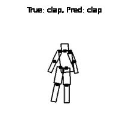

# What?

This repository contains Python skeleton for programming 
assignments of Coursera course "Probabilistic Graphical Models" by Daphne Koller.

At the moment, all the assignments from Part B and C are ported. 
From Part A last three assignments have been ported. I am working on the first assignment.

# Why?

The course assignments are written in MATLAB/OCTAVE. I personally find
this language harder in modern times and feel that newcomers generally
would be more familiar with Python than MATLAB. 

Also, the course assignments provide a lot of boilerplate code which also contains
a lot of details. I felt that implementing the assignments+boilerplate
in Python would be a better way to master the course material.

# How?

Download the original zip and extract it somewhere. Copy all `*.mat` files 
from that directory into `data` directory inside respective assignment here.

All functions that you will have to implement are in `solution.py`. 
Once you are finished with one function implementation, you can check 
your implementation locally in `check.ipynb`. This notebook does 
the work of reading `.mat` file and converting it into appropriate
structures. Once you are satisfied with your solution, you can 
submit your solution by running `submit.py` script. The script
will ask you for your email address and token.

## Before you start
Please go through my implementation of [factor](commons/factor.py). 
This is the most important/common class that you will work with.

Factor is basically a lookup table (a dictionary) made of discrete variables.
Each variable has some cardinality. Say you want to create a factor over two binary variables. Use `Factor([0, 1], [2, 2])`. The first argument is a list
of variable names. Second argument is cardinality of each variable in first 
argument.

- Also note that I've used 0 based indexing unlike original MATLAB code, so variable `1` can 
take either value `0` or `1`.

## Note:
- Although I've tested the assignments (i.e. almost in all cases I got 100/100.), there 
could be hidden bugs which might mark your solution wrong even though your solution is correct. If you feel that your solution is correct but it is marked wrong, please debug first 
in the `check.ipynb` and see if expected output matches with your output, and then raise an issue. I'll look into it.

# Acknowledgements 
- The Python grader is derived from [Gerges Dib](https://github.com/dibgerge/ml-coursera-python-assignments)'s code, which itself is derived from [Marcel Stampfer](https://github.com/mstampfer/Coursera-Stanford-ML-Python)'s code.
